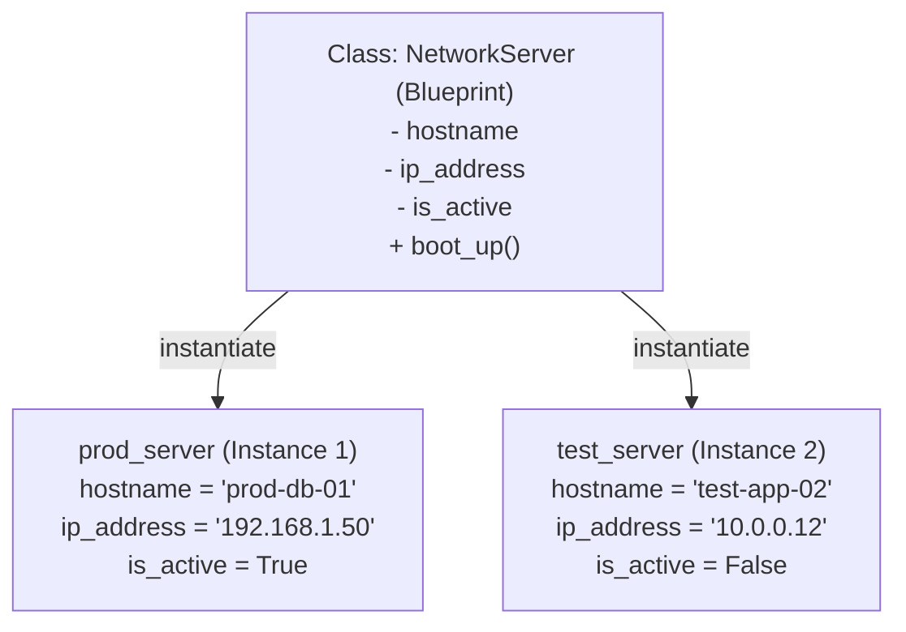

# Classes & Objects: The Blueprint

Welcome to the core of Object-Oriented Programming (OOP). Up until now, we have passed raw data structures, like dictionaries and lists, into standalone functions. In OOP, we bundle data and the functions that manipulate that data together into cohesive, intelligent units called **objects**.

---

## 1. The Blueprint vs. The Object

Before writing code, it is critical to understand the relationship between a **Class** and an **Object**:

* **The Class (The Blueprint):** A conceptual model or template. It defines what data an entity holds and what actions it can perform, but it does not contain real-world data itself.
* **The Object (The Instance):** A concrete implementation created from that class blueprint. It occupies its own space in memory and holds real, specific data. You can instantiate thousands of unique objects from a single class blueprint.



---

## 2. Writing Your First Class

Let us model a network server to see class definition and instantiation in action:

```python
class NetworkServer:
    """Represents an individual server in a network infrastructure."""

    # The Constructor: Initializes the object's instance state
    def __init__(self, hostname: str, ip_address: str):
        self.hostname = hostname      # Instance Attribute (State)
        self.ip_address = ip_address  # Instance Attribute (State)
        self.is_active = False        # Default Instance Attribute

    # An Instance Method: Defines the object's behavior
    def boot_up(self):
        self.is_active = True
        print(f"Server '{self.hostname}' ({self.ip_address}) is now ONLINE.")

# Creating Objects (Instances)
prod_server = NetworkServer("prod-db-01", "192.168.1.50")
test_server = NetworkServer("test-app-02", "10.0.0.12")

# Interacting with the Objects
prod_server.boot_up()
print(f"Test server active status: {test_server.is_active}")
```

### Deconstructing the Syntax

* **`class` keyword:** Defines the blueprint. We use `PascalCase` naming conventions for classes in Python (e.g., `NetworkServer`, not `network_server`).
* **`__init__` method:** The constructor / initializer. Python automatically invokes this method the moment a new object is created to configure its initial state.
* **`self` parameter:** An explicit reference to the specific instance calling the method. When you call `prod_server.boot_up()`, Python converts it behind the scenes to `NetworkServer.boot_up(prod_server)`. `self` ensures that changes modify *that specific object's* memory space without leaking into others.
* **Instance Attributes:** Variables bound to `self` (such as `self.hostname`). They belong strictly to that individual instance.
* **Instance Methods:** Functions declared inside a class that accept `self` as their first parameter. They represent the actions the object can perform.

---

## 3. Class Attributes vs. Instance Attributes

Not all data belongs strictly to a single instance. Sometimes data belongs to the **entire class** and must be shared across every instance.

* **Instance Attributes:** Declared inside methods using `self.<name>`. Unique to every individual object.
* **Class Attributes:** Declared directly inside the class body, outside of any method. Shared by all instances of the class.

```python
class NetworkServer:
    # Class Attribute: Shared across all instances
    default_ssh_port = 22
    total_servers_count = 0

    def __init__(self, hostname: str, ip_address: str):
        # Instance Attributes: Unique to this specific object
        self.hostname = hostname
        self.ip_address = ip_address
        
        # Updating the shared class state
        NetworkServer.total_servers_count += 1

# Inspecting class attributes
s1 = NetworkServer("web-01", "10.0.0.1")
s2 = NetworkServer("web-02", "10.0.0.2")

print(f"Total servers deployed: {NetworkServer.total_servers_count}")  # Outputs: 2
print(f"Default port via class: {NetworkServer.default_ssh_port}")    # Outputs: 22
print(f"Default port via instance: {s1.default_ssh_port}")            # Outputs: 22
```

> [!CAUTION]
> **The Mutable Class Attribute Trap**
>
> Never use mutable collections (lists, dicts, sets) as class attributes unless you intentionally want **every instance to mutate the exact same object**!

```python
# ❌ BUG: Shared list across all servers
class BrokenServer:
    installed_packages = []  # Class attribute! Shared by ALL instances!

s1 = BrokenServer()
s2 = BrokenServer()
s1.installed_packages.append("nginx")
print(s2.installed_packages)  # ['nginx'] -> s2 was unintentionally modified!

# ✅ CORRECT: Instance attribute inside __init__
class SafeServer:
    def __init__(self):
        self.installed_packages = []  # Unique to each instance
```

---

## 4. The Three Types of Methods

Python classes support three distinct types of methods:

1. **Instance Methods (`self`):** The default. Can read and modify instance state (`self`) as well as class state.
2. **Class Methods (`@classmethod`, `cls`):** Bound to the class rather than an instance. Receives the class (`cls`) as its first parameter. Commonly used for **alternative constructors / factory methods**.
3. **Static Methods (`@staticmethod`):** Independent utility functions grouped logically inside the class's namespace. Does not receive `self` or `cls`.

```python
class NetworkServer:
    default_domain = "internal.net"

    def __init__(self, hostname: str, ip_address: str):
        self.hostname = hostname
        self.ip_address = ip_address

    # 1. Instance Method (Operates on one specific server)
    def get_fqdn(self) -> str:
        return f"{self.hostname}.{NetworkServer.default_domain}"

    # 2. Class Method (Factory constructor from a CSV/config line)
    @classmethod
    def from_csv_string(cls, csv_line: str):
        """Creates a NetworkServer instance from a 'hostname,ip' string."""
        hostname, ip = csv_line.strip().split(",")
        return cls(hostname, ip)

    # 3. Static Method (Self-contained utility helper)
    @staticmethod
    def is_valid_ipv4(ip: str) -> bool:
        """Validates standard IPv4 formatting without needing instance state."""
        parts = ip.split(".")
        return len(parts) == 4 and all(p.isdigit() and 0 <= int(p) <= 255 for p in parts)


# 1. Using the instance method
server_a = NetworkServer("db-primary", "192.168.1.10")
print(server_a.get_fqdn())  # db-primary.internal.net

# 2. Using the class method (alternative constructor)
server_b = NetworkServer.from_csv_string("cache-01,192.168.1.20")
print(f"Created: {server_b.hostname} at {server_b.ip_address}")

# 3. Using the static method directly
print(NetworkServer.is_valid_ipv4("192.168.1.1"))  # True
print(NetworkServer.is_valid_ipv4("999.1.1.1"))    # False
```

---

## 5. Method Comparison Summary

| Method Type | Decorator | First Argument | Can Access Instance (`self`)? | Can Access Class (`cls`)? | Primary Use Case |
| :--- | :--- | :--- | :--- | :--- | :--- |
| **Instance Method** | None | `self` | Yes | Yes (via `type(self)`) | Modifying or querying the individual object's state |
| **Class Method** | `@classmethod` | `cls` | No | Yes | Factory methods, alternative constructors, class-level config |
| **Static Method** | `@staticmethod` | None | No | No | Pure utility or validation logic grouped under the class name |

---

## 6. Common Gotchas to Avoid

* **Forgetting `self` in method definitions:**  
Defining `def boot_up():` inside a class will cause a `TypeError: boot_up() takes 0 positional arguments but 1 was given` when called on an instance.

* **Shadowing Class Attributes:**  
Assigning `s1.default_ssh_port = 2222` does **not** change the class attribute. It creates a brand-new instance attribute named `default_ssh_port` on `s1`, leaving `NetworkServer.default_ssh_port` unchanged. Always mutate class attributes via `ClassName.attribute = value`.
