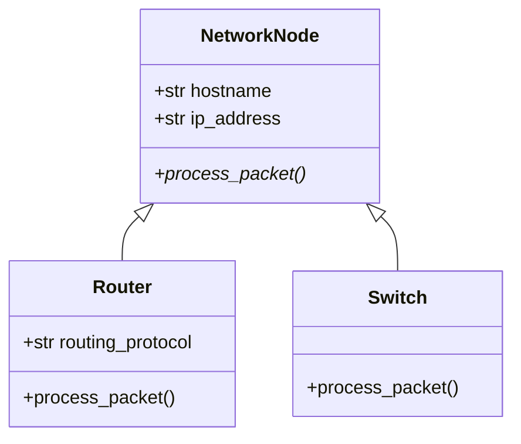

# Inheritance & Polymorphism

In software engineering, repeating yourself is a major liability. If a bug exists in duplicated code, you must fix it in multiple places. **Inheritance** allows you to keep your code DRY (Don't Repeat Yourself) by establishing parent-child relationships between classes, while **Polymorphism** allows different classes to respond to the same method call in their own unique ways.

---

## 1. The Concept: "IS-A" Relationships

Inheritance should strictly represent an **"IS-A"** relationship:

* A `Router` **is a** `NetworkNode`.
* A `Switch` **is a** `NetworkNode`.
* A `Firewall` **is a** `NetworkNode`.

All of these devices share common characteristics (a hostname, an IP address, and a MAC address), but each device processes packets differently.



---

## 2. Implementing Base and Subclasses

Let us build this hierarchy in Python using `super()` and method overriding:

```python
class NetworkNode:
    """The Parent (Base) Class"""
    def __init__(self, hostname: str, ip_address: str):
        self.hostname = hostname
        self.ip_address = ip_address

    def process_packet(self, packet_id: str):
        """A base method meant to be overridden by child classes."""
        print(f"[{self.hostname}] Base node dropping packet {packet_id}.")


class Router(NetworkNode):
    """A Child (Derived) Class inheriting from NetworkNode"""
    def __init__(self, hostname: str, ip_address: str, routing_protocol: str):
        # super() invokes the parent class constructor
        super().__init__(hostname, ip_address)
        self.routing_protocol = routing_protocol

    # Overriding the parent's method
    def process_packet(self, packet_id: str):
        print(f"[{self.hostname}] Routing packet {packet_id} via {self.routing_protocol}.")


class Switch(NetworkNode):
    """Another Child Class"""
    def process_packet(self, packet_id: str):
        print(f"[{self.hostname}] Switching packet {packet_id} via MAC address table.")
```

### Deconstructing the Syntax

* **`class Router(NetworkNode):`** Specifies that `Router` inherits all attributes and methods from `NetworkNode`.
* **`super().__init__(hostname, ip_address)`:** Calls the parent's constructor. This avoids re-implementing attribute assignment (`self.hostname = hostname`) across every child class.
* **Method Overriding:** Both `Router` and `Switch` define their own `process_packet()` method, replacing the generic parent behavior.

---

## 3. Polymorphism in Action

**Polymorphism** (meaning "many forms") allows us to treat different child objects uniformly through their shared parent interface:

```python
devices = [
    Router("core-rtr-01", "10.0.0.1", "BGP"),
    Switch("access-sw-01", "10.0.1.2"),
    Router("edge-rtr-02", "192.168.1.1", "OSPF")
]

# We do not care if an item is a Router or a Switch!
# Python dynamically routes to the correct implementation.
for dev in devices:
    dev.process_packet("PKT-90210")
```

**Output:**

```text
[core-rtr-01] Routing packet PKT-90210 via BGP.
[access-sw-01] Switching packet PKT-90210 via MAC address table.
[edge-rtr-02] Routing packet PKT-90210 via OSPF.
```

---

## 4. Type Checking: `isinstance()` vs. `issubclass()`

When checking an object's type in Python, always prefer `isinstance()` over direct type comparison (`type(x) == Y`), because `isinstance()` respects the inheritance tree:

```python
rtr = Router("R1", "10.0.0.1", "OSPF")

# isinstance checks instances
print(isinstance(rtr, Router))       # True
print(isinstance(rtr, NetworkNode))  # True (A Router IS-A NetworkNode)
print(isinstance(rtr, Switch))       # False

# issubclass checks class definitions
print(issubclass(Router, NetworkNode))  # True
print(issubclass(Switch, Router))       # False
```

---

## 5. Abstract Base Classes (ABCs): Enforcing Contracts

In the initial example, `NetworkNode.process_packet()` had a dummy print statement. What if a developer creates a new child class but forgets to override `process_packet()`?

To strictly enforce that subclasses implement required methods, Python provides **Abstract Base Classes** via the `abc` module:

```python
from abc import ABC, abstractmethod

class NetworkNode(ABC):
    def __init__(self, hostname: str, ip_address: str):
        self.hostname = hostname
        self.ip_address = ip_address

    # Abstract method: MUST be implemented by any concrete child class
    @abstractmethod
    def process_packet(self, packet_id: str):
        pass


# Attempting to instantiate an abstract class directly will raise a TypeError:
# node = NetworkNode("generic", "10.0.0.1")
# TypeError: Can't instantiate abstract class NetworkNode with abstract method process_packet


class Firewall(NetworkNode):
    # If Firewall forgets to implement process_packet(), Python will refuse to instantiate it!
    def process_packet(self, packet_id: str):
        print(f"[{self.hostname}] Filtering packet {packet_id} against security rules.")

fw = Firewall("perimeter-fw", "10.0.0.254")
fw.process_packet("PKT-100")
```

---

## 6. Multiple Inheritance & Method Resolution Order (MRO)

Unlike many languages (like Java or C#), Python permits a class to inherit from multiple parent classes. This is commonly used for **Mixins**—small, focused classes that provide reusable utility behavior.

```python
class LoggingMixin:
    """A mixin class providing standard diagnostic logging."""
    def log(self, message: str):
        print(f"[LOG] {getattr(self, 'hostname', 'UNKNOWN')}: {message}")


class MonitoringMixin:
    """A mixin class providing telemetry reporting."""
    def report_metrics(self):
        print(f"[METRICS] Reporting health telemetry for {getattr(self, 'hostname', 'UNKNOWN')}.")


# Multiple Inheritance: inherits from NetworkNode, LoggingMixin, and MonitoringMixin
class ManagedSwitch(NetworkNode, LoggingMixin, MonitoringMixin):
    def process_packet(self, packet_id: str):
        self.log(f"Processing frame {packet_id}")
        print(f"[{self.hostname}] Forwarding packet...")

sw = ManagedSwitch("sw-dist-01", "10.10.1.1")
sw.process_packet("PKT-55")
sw.report_metrics()
```

### The Diamond Problem & MRO

When multiple parents provide the same method, Python determines which one to execute using the **C3 Linearization algorithm**, known as the **Method Resolution Order (MRO)**.

You can view the exact resolution path using `ClassName.mro()` or `ClassName.__mro__`:

```python
print(ManagedSwitch.mro())
# [ManagedSwitch, NetworkNode, ABC, LoggingMixin, MonitoringMixin, object]
```

Python traverses this list from left to right, guaranteeing that child classes are checked before parents, and multiple parents are checked in the order listed.

---

## 7. Common Gotchas to Avoid

* **Forgetting `super().__init__()`:**  
If you override `__init__` in a child class without calling `super().__init__()`, the parent attributes (`self.hostname`, `self.ip_address`) will never be initialized, causing an `AttributeError` later!

* **Deep Inheritance Hierarchies:**  
Avoid creating hierarchies deeper than 2–3 levels (e.g., `Device -> NetworkDevice -> Layer3Device -> SecureLayer3Device -> EnterpriseRouter`). Deep hierarchies become brittle and difficult to debug. Prefer **Composition** when relationships are complex.
