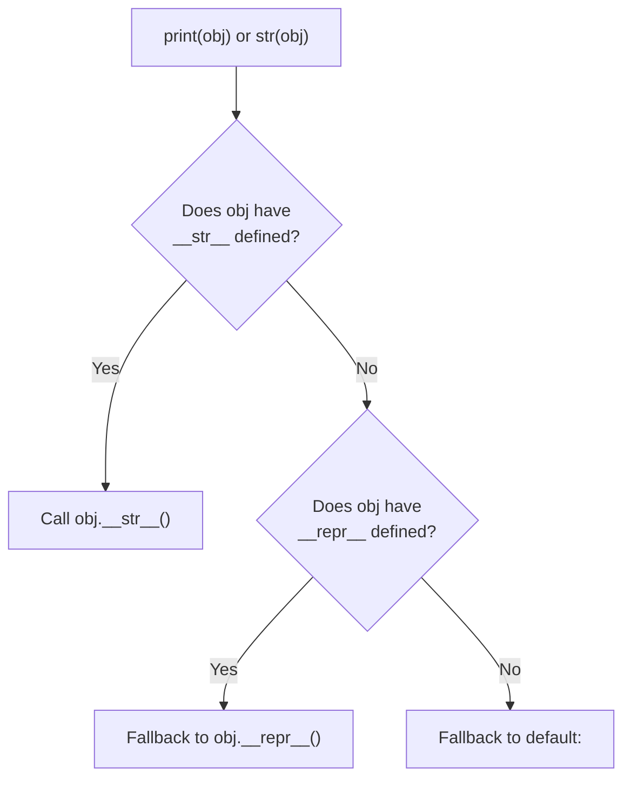

# Magic (Dunder) Methods

Python objects have hidden superpowers. Built-in functions like `len()`, `print()`, equality checks (`==`), and mathematical operators (`+`, `-`) do not work on custom classes out of the box.

To enable your custom objects to seamlessly integrate with Python's syntax and standard library, you implement **Magic Methods** (also known as **Dunder Methods**, short for *Double Underscore*).

---

## 1. String Representations: `__repr__` vs. `__str__`

The most common mistake Python developers make is confusing `__repr__` and `__str__`. Both return strings, but they serve completely different audiences:

* **`__repr__(self)`:** **Goal: Unambiguous.** Intended for developers, debugging, and logging. Ideally, it should look like valid Python code that could recreate the object (e.g., `ServerCluster('Database', ['node-1'])`).
* **`__str__(self)`:** **Goal: Readable.** Intended for end-users. Called when you pass the object to `print()` or `format()`.



> [!TIP]
> **Best Practice Rule of Thumb:**
> Always implement `__repr__` first! If you only implement `__repr__`, Python will use it as a fallback for `print()` and `str()` as well.

---

## 2. Building a Custom `ServerCluster`

Let us implement a comprehensive `ServerCluster` class demonstrating string representations, math operators, comparisons, and container protocols:

```python
class ServerCluster:
    def __init__(self, cluster_name: str, nodes: list[str] = None):
        self.cluster_name = cluster_name
        self.nodes = list(nodes) if nodes is not None else []

    # 1. Developer Representation (Debugging / Logging)
    def __repr__(self) -> str:
        return f"ServerCluster(cluster_name={self.cluster_name!r}, nodes={self.nodes!r})"

    # 2. User-Friendly String Representation
    def __str__(self) -> str:
        return f"Cluster '{self.cluster_name}' with {len(self.nodes)} active node(s)."

    # 3. Emulating Container Length: len(cluster)
    def __len__(self) -> int:
        return len(self.nodes)

    # 4. Emulating Indexing: cluster[0]
    def __getitem__(self, index: int) -> str:
        return self.nodes[index]

    # 5. Emulating Membership: 'node-01' in cluster
    def __contains__(self, node_name: str) -> bool:
        return node_name in self.nodes

    # 6. Emulating Addition: cluster + "new-node" OR cluster1 + cluster2
    def __add__(self, other):
        if isinstance(other, str):
            new_nodes = self.nodes + [other]
            return ServerCluster(self.cluster_name, new_nodes)
        elif isinstance(other, ServerCluster):
            combined_name = f"{self.cluster_name}-{other.cluster_name}"
            return ServerCluster(combined_name, self.nodes + other.nodes)
        return NotImplemented

    # 7. Equality Check: cluster1 == cluster2
    def __eq__(self, other) -> bool:
        if not isinstance(other, ServerCluster):
            return NotImplemented
        return self.cluster_name == other.cluster_name and self.nodes == other.nodes
```

---

## 3. Putting Magic Methods to Work

Notice how our custom class now behaves exactly like a native Python data structure:

```python
# Initialization
db_cluster = ServerCluster("Database-Tier", ["db-01", "db-02"])

# print() invokes __str__
print(db_cluster)
# Outputs: Cluster 'Database-Tier' with 2 active node(s).

# REPL inspection or repr() invokes __repr__
print(repr(db_cluster))
# Outputs: ServerCluster(cluster_name='Database-Tier', nodes=['db-01', 'db-02'])

# len() invokes __len__
print(f"Total nodes: {len(db_cluster)}")  # 2

# Indexing invokes __getitem__
print(f"Primary node: {db_cluster[0]}")  # db-01

# 'in' keyword invokes __contains__
print("db-01" in db_cluster)   # True
print("web-99" in db_cluster)   # False

# '+' operator invokes __add__
expanded_cluster = db_cluster + "db-03"
print(len(expanded_cluster))    # 3

# '==' operator invokes __eq__
clone_cluster = ServerCluster("Database-Tier", ["db-01", "db-02"])
print(db_cluster == clone_cluster)  # True (compares values, not memory addresses!)
```

---

## 4. Context Managers: `__enter__` and `__exit__`

Whenever you use Python's `with` statement (e.g., `with open(...) as f:`), you are using magic methods! You can make any custom class work with `with` by defining `__enter__` and `__exit__`:

```python
class ManagedConnection:
    def __init__(self, host: str):
        self.host = host

    def __enter__(self):
        print(f"Connecting to {self.host}...")
        return self  # The value assigned to the 'as' variable

    def __exit__(self, exc_type, exc_val, exc_tb):
        print(f"Safely disconnecting from {self.host}.")
        return False  # False means do not suppress any exceptions that occurred


# Using with our custom context manager
with ManagedConnection("10.0.0.1") as conn:
    print(f"Running queries on {conn.host}")
```

**Output:**

```text
Connecting to 10.0.0.1...
Running queries on 10.0.0.1
Safely disconnecting from 10.0.0.1.
```

---

## 5. Dunder Methods Cheat Sheet

| Category | Method | Trigger / Built-in |
| :--- | :--- | :--- |
| **Representation** | `__repr__(self)` | `repr(obj)`, interactive shell inspection |
| | `__str__(self)` | `print(obj)`, `str(obj)`, `f"{obj}"` |
| **Comparisons** | `__eq__(self, other)` | `obj == other` |
| | `__lt__(self, other)` | `obj < other` |
| | `__hash__(self)` | `hash(obj)`, storing objects in `set` or as `dict` keys |
| **Collections** | `__len__(self)` | `len(obj)` |
| | `__getitem__(self, key)` | `obj[key]` |
| | `__contains__(self, item)` | `item in obj` |
| | `__iter__(self)` | `for item in obj:` |
| **Operators** | `__add__(self, other)` | `obj + other` |
| | `__sub__(self, other)` | `obj - other` |
| **Contexts** | `__enter__`, `__exit__` | `with obj as x:` |

---

## 6. Common Gotchas to Avoid

* **Must Return Strings:**  
Both `__str__` and `__repr__` must return a string. Returning an integer, list, or `None` will raise a runtime `TypeError`.

* **Return `NotImplemented` for Unknown Types:**  
When writing operators like `__add__` or `__eq__`, if the `other` operand is an unexpected type, return `NotImplemented` instead of raising an error. This allows Python to try the reverse operation on the other object (e.g., `other.__radd__`).
