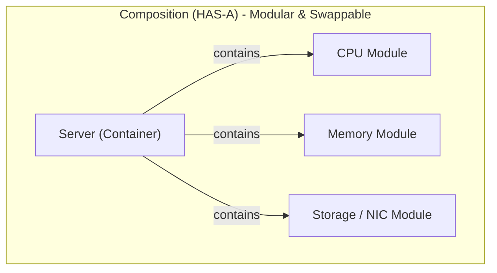

# Composition vs. Inheritance

One of the most famous pieces of advice in software engineering comes from the seminal *Design Patterns: Elements of Reusable Object-Oriented Software* (the Gang of Four):

> *"Favor object composition over class inheritance."*

The biggest architectural mistake beginners make in OOP is reaching for inheritance to solve every code-reuse problem. While inheritance creates tight, rigid coupling between parent and child classes, **Composition** builds flexible, modular systems by assembling independent parts.

---

## 1. "IS-A" vs. "HAS-A"

To decide between the two, ask yourself what relationship exists between the concepts:

* **Inheritance ("IS-A"):** A `Router` **is a** `NetworkNode`. A `Dog` **is an** `Animal`. The child class is a specialized variant of the parent.
* **Composition ("HAS-A"):** A `Server` **has a** `CPU`. A `Server` **has** `Memory`. A `Car` **has an** `Engine`. The outer container object contains components as attributes.



---

## 2. Tight Coupling vs. Dependency Injection

### The Problem: Tight Coupling

If a container class instantiates its own dependencies directly inside `__init__`, the classes become tightly coupled:

```python
# Tightly coupled: Server is permanently locked to this specific CPU class
class Server:
    def __init__(self, cores: int, ram_gb: int):
        self.cpu = CPU(cores)        # Rigid
        self.ram = Memory(ram_gb)    # Hard to test or customize
```

### The Solution: Composition via Dependency Injection

Instead of constructing components inside the class, pass them in as arguments (known as **Dependency Injection**). This makes your classes modular, easy to unit test, and open to extension:

```python
# 1. Independent Components
class CPU:
    def __init__(self, model: str, cores: int):
        self.model = model
        self.cores = cores

    def benchmark(self) -> str:
        return f"{self.model} ({self.cores} cores) running diagnostics: OK"


class Memory:
    def __init__(self, capacity_gb: int, speed_mhz: int = 3200):
        self.capacity_gb = capacity_gb
        self.speed_mhz = speed_mhz

    def status(self) -> str:
        return f"{self.capacity_gb}GB DDR4 @ {self.speed_mhz}MHz"


# 2. The Composite Container
class Server:
    """A composite server assembled from modular hardware components."""
    def __init__(self, hostname: str, cpu: CPU, ram: Memory):
        self.hostname = hostname
        # Storing component references (Composition)
        self.cpu = cpu
        self.ram = ram

    # Delegation: Forwarding tasks to the appropriate component
    def run_health_check(self):
        print(f"=== Health Report for Server '{self.hostname}' ===")
        print(f"CPU: {self.cpu.benchmark()}")
        print(f"RAM: {self.ram.status()}")


# 3. Assembling Components Dynamically
arm_cpu = CPU("Ampere Altra", 64)
high_ram = Memory(128, speed_mhz=3600)

# Injecting components into the server
prod_server = Server("cloud-compute-01", cpu=arm_cpu, ram=high_ram)
prod_server.run_health_check()
```

**Output:**

```text
=== Health Report for Server 'cloud-compute-01' ===
CPU: Ampere Altra (64 cores) running diagnostics: OK
RAM: 128GB DDR4 @ 3600MHz
```

---

## 3. The Power of Delegation

In composition, the parent class does not inherit hundreds of lines of methods. Instead, it **delegates** actions to whichever component is responsible for that task.

For example, if the server receives a compute request, it delegates calculation to `self.cpu`. If you want to change how memory operates or test the server with dummy hardware, you simply pass a mock component into `Server(...)` without touching a single line of the `Server` class!

---

## 4. Decision Matrix: When to Use Which

| Scenario | Choose | Rationale |
| :--- | :--- | :--- |
| Concept represents a specialized subtype ("A LinuxServer is a Server") | **Inheritance** | Shared interface and true polymorphism. |
| You want to enforce a contract with abstract methods (`abc.ABC`) | **Inheritance** | Enforces that all child classes implement required methods. |
| One object is composed of multiple smaller, distinct subparts | **Composition** | Natural real-world mapping; keeps components modular. |
| You need to change or swap an object's behavior at runtime | **Composition** | You can reassign attributes (`server.cpu = new_cpu`) dynamically. |
| Reusing utility methods across unrelated classes | **Composition** or **Mixins** | Avoids fragile, deep inheritance trees. |

---

## 5. Common Gotchas to Avoid

* **The God Object Anti-Pattern:**  
When using composition, avoid making the outer container do everything. Let each subcomponent do its own work. If your `Server` class starts calculating memory parity checks directly instead of letting `Memory` handle it, encapsulation is broken.

* **Forced Inheritance ("Yo-Yo Problem"):**  
If you find yourself jumping up and down 5 different files in an inheritance hierarchy just to understand what a single method does, that hierarchy should be refactored into composed objects.
